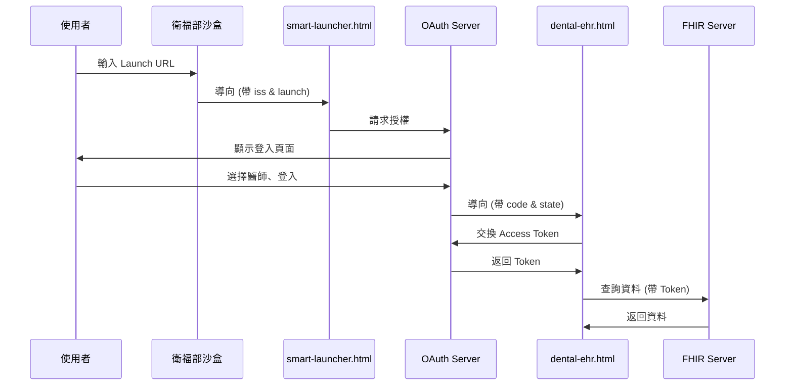

# 🔐 SMART on FHIR 整合使用指南

## 📋 系統說明

牙科跨院 FHIR 系統已成功整合 **SMART on FHIR** 標準，支援兩種運作模式：

### 🔹 模式一：獨立模式（原有功能）
直接開啟 `dental-ehr.html`，不需要任何授權，可獨立查詢 FHIR 資料。

### 🔹 模式二：SMART Launch 模式（新增功能）
從衛福部沙盒的 EHR Launch 功能啟動，通過 OAuth 2.0 授權後使用。

---

## 🚀 快速開始

### 在衛福部沙盒註冊

1. **登入衛福部 FHIR 沙盒**
   - 網址：https://thas.mohw.gov.tw/v/r4/fhir

2. **選擇「EHR Launch」**
   - 在沙盒介面選擇 "EHR Launch" 選項

3. **輸入 Launch URL**
   ```
   https://your-domain.com/smart-launcher.html
   ```
   > ⚠️ 請將 `your-domain.com` 替換為您實際部署的網址
   > 
   > 如果在本機測試：
   > - 使用 `http://localhost:8080/smart-launcher.html`
   > - 或使用 VS Code Live Server
   > - 或使用 GitHub Pages

4. **點擊「完成」按鈕**
   - 系統會自動導向 OAuth 授權流程

5. **選擇醫師並登入**
   - 在 Practitioner Login 頁面選擇醫師（如：Dr. Albertine Orn）
   - 輸入任意密碼（沙盒測試環境接受任何密碼）
   - 點擊「Login」

6. **自動跳轉回系統**
   - 授權成功後自動導向 `dental-ehr.html`
   - 右上角顯示 "🔐 SMART 授權" 標誌
   - 所有 FHIR 請求自動附帶 Access Token

---

## 📂 檔案說明

### 新增的檔案

#### 1. `smart-launcher.html`
**SMART Launch 入口頁面**

- 接收來自 EHR 的 `iss` 和 `launch` 參數
- 初始化 OAuth 2.0 授權流程
- 導向 FHIR 伺服器的授權端點

**使用時機：**
- 從沙盒 EHR Launch 啟動時的入口點
- 不應直接訪問此頁面

#### 2. `dental-ehr.html`（已修改）
**主系統頁面，整合 OAuth 支援**

**新增功能：**
- 自動檢測 OAuth callback 參數
- 處理 Access Token 交換
- 在 FHIR 請求中自動附加 Authorization header
- 顯示 SMART 模式指示器

**相容性：**
- 完全向下相容，獨立模式功能不受影響
- 如果沒有 OAuth 參數，正常以獨立模式運行

---

## 🔧 技術細節

### OAuth 2.0 授權流程



### SMART 配置參數

在 `smart-launcher.html` 中的配置：

```javascript
const SMART_CONFIG = {
    // 客戶端 ID（需向衛福部申請）
    clientId: "dental-cross-clinic-app",
    
    // 授權範圍
    scope: "launch patient/*.read Practitioner.read Procedure.read Condition.read Encounter.read Organization.read ImagingStudy.read openid fhirUser",
    
    // 重定向 URI
    redirectUri: window.location.origin + "/dental-ehr.html",
    
    // FHIR Server（從 URL 參數獲取）
    iss: null,
    
    // Launch Token（從 EHR 傳入）
    launch: null
};
```

### 修改後的 FHIR 查詢函數

```javascript
async function fhirQuery(resourceType, params = {}) {
    const headers = {
        'Accept': 'application/fhir+json',
        'Content-Type': 'application/fhir+json'
    };

    // 如果是 SMART 模式，加入 Authorization header
    if (IS_SMART_MODE && ACCESS_TOKEN) {
        headers['Authorization'] = `Bearer ${ACCESS_TOKEN}`;
    }
    
    const response = await fetch(url, {
        method: 'GET',
        headers: headers,
        mode: 'cors'
    });
    
    return await response.json();
}
```

---

## ⚙️ 部署方式

### 方案一：GitHub Pages（推薦）

1. 建立 GitHub 儲存庫
2. 上傳所有檔案
3. 在設定中啟用 GitHub Pages
4. Launch URL 使用：
   ```
   https://your-username.github.io/repo-name/smart-launcher.html
   ```

### 方案二：本機測試（開發用）

**使用 VS Code Live Server：**

1. 安裝 Live Server 擴充功能
2. 右鍵點擊 `smart-launcher.html`
3. 選擇「Open with Live Server」
4. Launch URL 使用：
   ```
   http://127.0.0.1:5500/smart-launcher.html
   ```

**使用 Python HTTP Server：**

```bash
# Python 3
python -m http.server 8080

# 訪問
http://localhost:8080/smart-launcher.html
```

**使用 Node.js http-server：**

```bash
# 安裝
npm install -g http-server

# 啟動
http-server -p 8080

# 訪問
http://localhost:8080/smart-launcher.html
```

### 方案三：雲端服務

- Netlify
- Vercel
- Azure Static Web Apps
- AWS S3 + CloudFront

---

## 🧪 測試步驟

### 1. 測試獨立模式（確保原功能正常）

1. 直接開啟 `dental-ehr.html`
2. 選擇患者：P002（李美玲）
3. 點擊「FHIR 跨院檢測」
4. 確認可正常查詢資料
5. 右上角**不應顯示** "🔐 SMART 授權"

### 2. 測試 SMART Launch 模式

1. 在沙盒註冊 Launch URL
2. 從沙盒啟動應用
3. 完成 Practitioner Login
4. 確認自動跳轉到 `dental-ehr.html`
5. 確認右上角顯示 "🔐 SMART 授權"
6. 開啟瀏覽器開發者工具（F12）
7. 查看 Console，應顯示：
   ```
   🔐 檢測到 OAuth callback，正在處理授權...
   👤 患者上下文: P001
   👨‍⚕️ 醫師資訊: Practitioner/123
   ✅ SMART 授權成功
   🔑 Access Token: 已獲取
   ✅ 系統已啟動
   模式: SMART Launch
   ```

### 3. 測試 FHIR 查詢（SMART 模式）

1. 在 SMART 模式下選擇患者
2. 點擊「FHIR 跨院檢測」
3. 開啟 Network 標籤
4. 確認 FHIR 請求包含 `Authorization: Bearer <token>` header
5. 確認資料正常返回

---

## ❓ 常見問題

### Q1: 直接訪問 smart-launcher.html 顯示錯誤

**A:** 這是正常的！`smart-launcher.html` 只能從 EHR 系統啟動，不應直接訪問。
錯誤訊息會引導您：
- 使用獨立模式（點擊「使用獨立模式」按鈕）
- 或從沙盒正確啟動

### Q2: 授權後沒有自動跳轉

**A:** 檢查以下項目：
1. `redirectUri` 設定是否正確
2. 瀏覽器是否阻擋彈出視窗
3. 查看 Console 是否有錯誤訊息

### Q3: Token 無法獲取

**A:** 可能原因：
1. Client ID 未在沙盒註冊
2. Scope 設定不正確
3. CORS 設定問題
4. 網路連線問題

**解決方式：**
- 聯繫衛福部確認 Client ID
- 使用獨立模式繼續工作

### Q4: 如何確認是否在 SMART 模式？

**A:** 查看以下指標：
1. 右上角有 "🔐 SMART 授權" 標誌
2. Console 顯示 "模式: SMART Launch"
3. Network 請求有 Authorization header

### Q5: 需要向衛福部申請 Client ID 嗎？

**A:** 是的，生產環境需要。測試環境可能可以使用預設 ID。
請向衛福部沙盒管理員詢問：
- Client ID 註冊流程
- Redirect URI 白名單設定
- 支援的 Scope 清單

---

## 🔍 除錯指南

### 啟用除錯模式

`smart-launcher.html` 會自動顯示除錯資訊（如果發生錯誤）。

**除錯資訊包含：**
- URL：完整的 Launch URL
- ISS：FHIR Server 端點
- Launch：Launch Token
- Client ID：客戶端識別碼

### Console 訊息說明

| 訊息 | 意義 |
|------|------|
| `🔐 檢測到 OAuth callback...` | 正在處理授權 |
| `✅ SMART 授權成功` | 授權完成 |
| `❌ SMART 授權處理失敗` | 授權失敗，查看錯誤詳情 |
| `📋 獨立模式運行` | 無 OAuth 參數，使用獨立模式 |
| `🔑 使用 SMART Token 進行 FHIR 查詢` | 每次 FHIR 請求時 |

---

## 📊 系統架構

```
📁 專案目錄
├── 📄 smart-launcher.html          # SMART Launch 入口
├── 📄 dental-ehr.html              # 主系統（已整合 OAuth）
├── 📄 SMART_LAUNCH_GUIDE.md        # 本文件
├── 📄 TestPatients_Transaction.json # 測試資料
├── 📄 DentalCrossClinicRules.cql   # CQL 規則
└── 📄 README.md                    # 原系統說明
```

---

## 🎯 下一步建議

### 短期（測試階段）

1. ✅ 在本機測試 SMART Launch 流程
2. ✅ 確認兩種模式都能正常運作
3. ✅ 測試所有 FHIR 查詢功能

### 中期（沙盒測試）

1. 向衛福部申請正式 Client ID
2. 在沙盒環境完整測試
3. 收集測試數據和反饋

### 長期（生產部署）

1. 選擇正式部署方案（GitHub Pages / 雲端服務）
2. 配置 HTTPS（必須）
3. 進行安全性審查
4. 正式上線

---

## 📞 支援與聯繫

### 技術問題
- 查看 Console 除錯訊息
- 檢查 Network 請求詳情
- 參考 [SMART on FHIR 官方文件](https://docs.smarthealthit.org/)

### 衛福部沙盒相關
- 聯繫沙盒管理員
- 索取 Client ID 註冊文件
- 確認支援的授權流程

---

## 📝 版本記錄

### v1.0（當前版本）
- ✅ 整合 SMART on FHIR 授權
- ✅ 建立 smart-launcher.html
- ✅ 修改 dental-ehr.html 支援 OAuth
- ✅ 保持獨立模式向下相容
- ✅ 自動偵測並處理 OAuth callback
- ✅ 在 FHIR 請求中自動附加 Token

---

## 🌟 特色功能

### 1. 零學習成本
- 對於獨立模式使用者：完全無感，照常使用
- 對於 SMART 模式：自動處理，無需手動配置

### 2. 雙模式並存
- 不破壞原有功能
- 靈活切換使用方式
- 降低遷移風險

### 3. 自動化處理
- OAuth Token 自動管理
- 授權狀態自動檢測
- FHIR 請求自動附加 Token

### 4. 開發友善
- 詳細的 Console 訊息
- 完整的除錯資訊
- 清晰的錯誤提示

---

**祝使用順利！** 🎉
